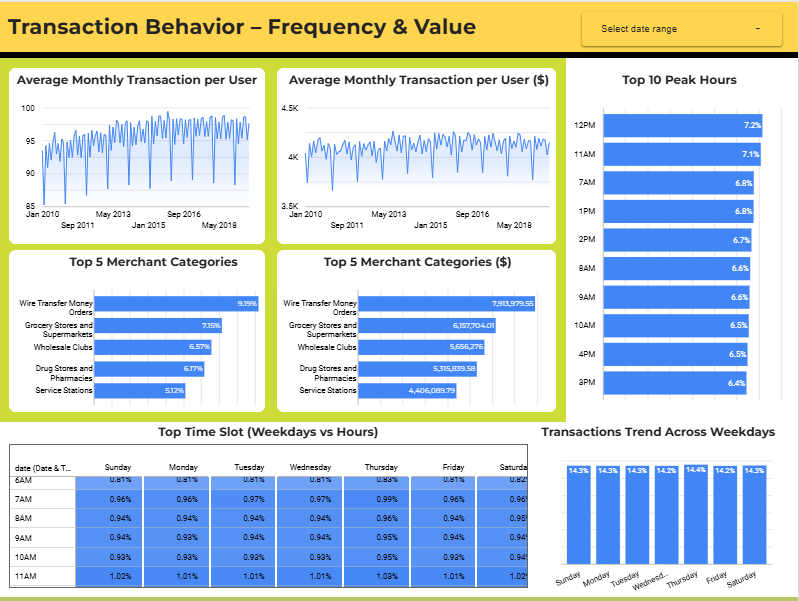
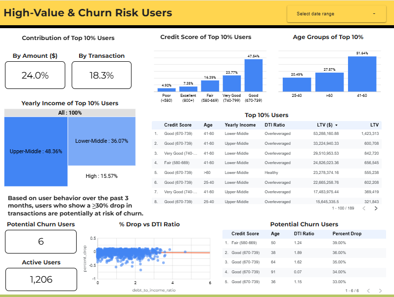

# SQL Query for Bank Transaction Analysis

## Introduction

This repository contains SQL scripts used to analyze private bank transaction data. The source data includes anonymized `.csv` files named:

- `transactions_data.csv`
- `users_data.csv`
- `cards_data.csv`

Files can be downloades [here](https://drive.google.com/drive/folders/14U87BRaPXvv-l9E7dysGqY0VjVv4lxKP?usp=drive_link).

These queries aim to uncover user behavior, transaction patterns, and financial risk indicators. Although the raw data is private, this guide will help you replicate the analytical process using Google BigQuery.

---

## Environment Setup

All SQL scripts are designed to run on **Google BigQuery**. Follow the steps below to set up your environment:

1. **Create a Dataset**
   - Go to Google BigQuery Console.
   - Create a new dataset named: `ms_data`

2. **Upload CSV Files to Google Cloud Storage**
   - Upload the `transactions_data.csv`, `users_data.csv`, and `cards_data.csv` to a bucket in Google Cloud Storage.

3. **Load Data into BigQuery**
   - From the BigQuery console, load each CSV file into the `ms_data` dataset as a separate table:
     - `transactions_data`
     - `users_data`
     - `cards_data`

4. **Run SQL Files**
   - Open the SQL files in this repository.
   - Copy and paste the SQL code into the BigQuery editor.
   - Run the queries to generate the results.

---

## 5 Key Business Questions (SMART Goals)

The SQL scripts are structured to answer these five strategic questions:

1. **Who are our main user segments based on age, income, and credit score over the last 6 months?**  
   → To identify dominant profiles & main market potential.

2. **What is the average number and value of transactions per user per month over the past 12 months?**  
   → To assess engagement and purchasing power.

3. **When are the transaction activity peaks (day & hour) in the last 3 months, and which merchant categories are most used?**  
   → To identify peak times and top categories for promo strategies.

4. **Who are the top 10% of users contributing most to total transactions (Lifetime Value) in 2025, and what are their demographic traits?**  
   → To focus on high-value customers for retention & upselling.

5. **How many users are at risk of churn (≥50% drop in transactions in the last 3 months), and do they show financial red flags (e.g., high debt-to-income ratio, low credit score)?**  
   → To detect early signs of churn and financial risk.

---

## Additional Files

- CSV outputs from all SQL queries are provided for reference.
- A [presentation](User%20Behavior%20Analysis%20-%20MS%20-%20DCA.pdf) summarizing the analysis insights is included.
- [Looker Studio Dashboard (link here)](https://lookerstudio.google.com/reporting/bca5c165-f8a9-45fd-843c-14f97d040445) provides an interactive visualization of the findings.

---

## Contact

For questions or collaboration, please contact [Fikri Aulyanor](mohfikri.aulyanor@gmail.com) at [mohfikri.aulyanor@gmail.com].

